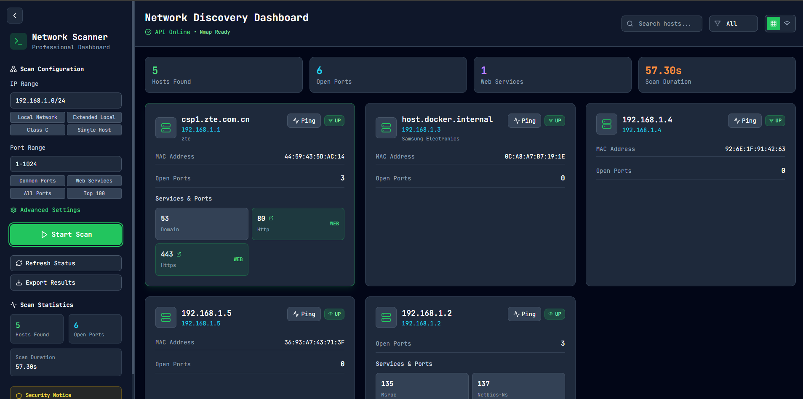
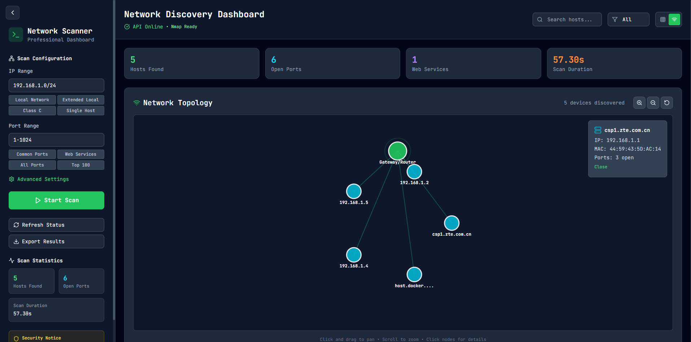

# Network Discovery (React + Vite)

[](https://vitejs.dev)
[](https://reactjs.org)
[](LICENSE)

A lightweight front-end application (React + Vite) for visualizing network discovery results — topology maps, scan results and device details. This README replaces the starter template and integrates the screenshots you added to the repository.

---

## Table of contents

- [Overview](#overview)  
- [Features](#features)  
- [Screenshots](#screenshots)  
- [Quick start](#quick-start)  
- [Development](#development)  
- [Build & deploy](#build--deploy)  
- [Add / update screenshots](#add--update-screenshots)  
- [Contributing](#contributing)  
- [License](#license)

---

## Overview

Network-Discovery provides a UI to inspect results from network scans and discovery tools. It focuses on:

- visual network topology,
- per-device details and scan history,
- filtering/searching devices,
- exporting/importing scan data.

This repository contains the front-end UI. It can be used standalone (visualizer) or connected to a scanning back-end.

---

## Features

- Interactive topology map with zoom/pan  
- Device list with search, filter, and details panel  
- Scan results timeline and charts  
- Import/export scan data (JSON/CSV)  
- Extensible components for custom endpoints

---

## Screenshots

The three screenshots you uploaded are embedded below. They are located in the repository root (HomeScreen.png, ScanScreen.png, TopologyScreen.png) and will render on GitHub as long as the filenames match exactly (case-sensitive).

### Home / Dashboard


### Scan Results


### Topology Map


---

## Quick start

Requirements:
- Node.js v16+ (LTS recommended)
- npm or yarn

Clone and install:

```bash
git clone https://github.com/b1l4l-sec/Network-Discovery.git
cd Network-Discovery
npm install
# or
# yarn install
```

Run the dev server:

```bash
npm run dev
# or
# yarn dev
```

Open http://localhost:5173 (or the port shown in the terminal).

---

## Development

- Source: `src/`  
- Public assets & favicon: `public/` (static images may also be placed in `public/images/`)  
- Styling using Tailwind CSS (see `tailwind.config.js`)  
- Linting via ESLint (`eslint.config.js`)

Common scripts:

```bash
npm run dev      # start dev server
npm run build    # production build
npm run preview  # preview production build
npm run lint     # run linter
```

---

## Build & deploy

Create a production build:

```bash
npm run build
```

Deploy the contents of `dist/` to your static host (Netlify, GitHub Pages, S3, etc.).

---

## Add / update screenshots

If you need to change or add screenshots:

1. Place images in the repository root or `public/images/` (recommended).
2. Update the image links in this README if you move them to `public/images/` (e.g., `public/images/HomeScreen.png`).
3. Commit and push:

```bash
git checkout -b docs/add-screenshots
git add README.md HomeScreen.png ScanScreen.png TopologyScreen.png
git commit -m "docs: update README and embed screenshots"
git push -u origin docs/add-screenshots
```

Open a Pull Request and merge when ready.

---

## Contributing

Contributions are welcome. Suggested workflow:

1. Fork the repo  
2. Create a feature branch (e.g., `feature/my-change`)  
3. Make changes and add tests if applicable  
4. Open a Pull Request describing the change

---

## License

MIT — see `LICENSE` for details.

---

If you want, I can prepare the branch and the commit for you (I'll provide the exact patch and commands). Tell me whether you want me to:
- create a branch + PR instructions (I give the commands you run), or
- produce a patch file you can apply locally, or
- nothing — you'll paste and push yourself.
