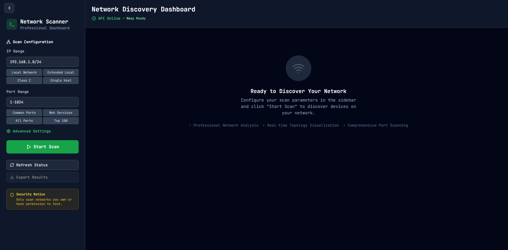

# Network Discovery (React + Vite)

[](https://vitejs.dev)
[](https://reactjs.org)
[](LICENSE)

A front-end application built with React + Vite that visualizes network discovery data — topology, scan results and device details. This README replaces the starter template and embeds the three screenshots you added to the repository.

---

## Table of Contents

- [Overview](#overview)  
- [Features](#features)  
- [Screenshots](#screenshots)  
- [Quick start](#quick-start)  
- [Development](#development)  
- [Build & Deploy](#build--deploy)  
- [Add or update screenshots](#add-or-update-screenshots)  
- [Contributing](#contributing)  
- [License](#license)

---

## Overview

Network-Discovery is a lightweight UI for visualizing results from network scanning and discovery tools. It can be used as a standalone visualizer or a front-end for a scanning back-end. It focuses on clear device listing, interactive topology maps and detailed per-device scan results.

---

## Features

- Interactive network topology and device map  
- Device details and scan results view  
- Search and filter devices by IP, MAC, vendor or status  
- Export/import scan results (JSON/CSV)  
- Easily extendable components to connect to a backend API

---

## Screenshots

I embedded the three screenshots you added. They will render when the image files are present in the repository (root) or under `public/` (if you placed them there). If you put images in `public/images/`, update the paths below accordingly.

(If the filenames you used differ from the examples below, replace them with the exact filenames.)

### Home (main dashboard)


### Scan results / timeline


### Device details / insights


> Note: If your images are located in `public/images/`, use:
> `` etc.

---

## Quick start

Requirements:
- Node.js v16+ (or latest LTS)
- npm or yarn
- Git

Clone and install:

```bash
git clone https://github.com/b1l4l-sec/Network-Discovery.git
cd Network-Discovery
npm install
# or
# yarn install
